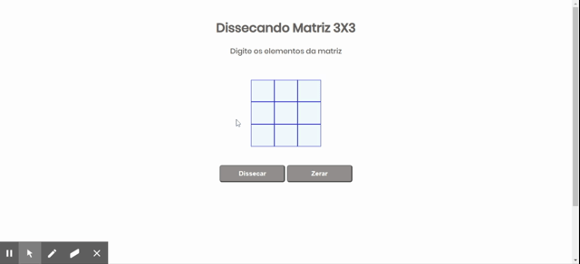

# Dissecando uma matriz 3X3

Aplicaçao simples que calcula soma de elementos de uma matriz.
Sem utilizar inputs, o valor é digitado em div editável e transformado em dados de um array.

## Author 
[ViviRamos](https://linkedin.com/in/viviane-ramos-luz-346169187)

